# Temperans Habits

Bring habit data together from websites, APIs, and companion apps, alongside ordinary manual logging. Temperans keeps the combined history as readable Markdown in your configured operation folder (default: `Habit Logs`) and provides calendar views, targets, and analytics. Endpoint and companion imports are core features.

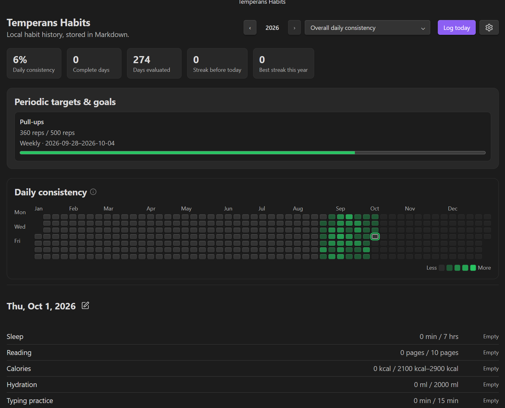

## Tasks and schedules

New installations start with just **Reading** as a clean, editable starter. You can browse presets for **Health Connect** metrics and **Connected APIs**, or create custom habits to suit your routine. Existing configurations retain their current habit list.

| Interactive heat map with hover details | Single habit focus (Sleep) |
| :---: | :---: |
| 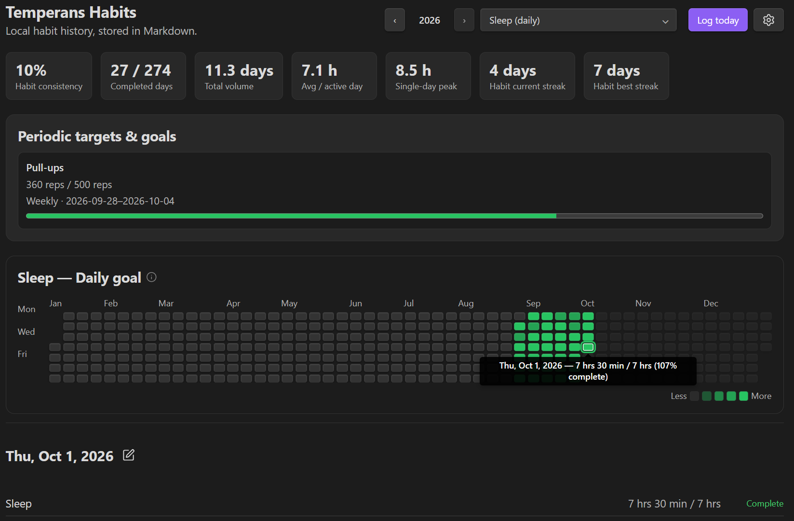 | 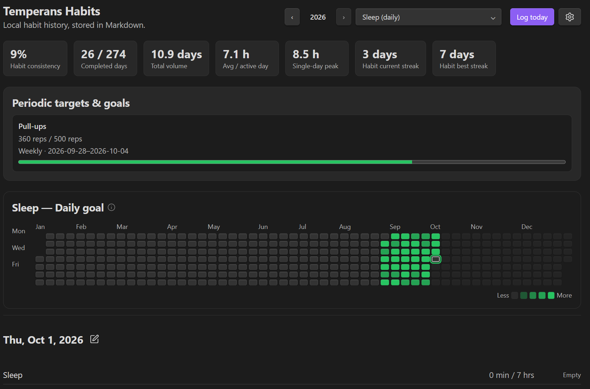 |

Manage all your habits through **Settings → Temperans Habits → Configure habits**.
- **Three Habit Archetypes**:
  - **Build Habits**: Daily, weekly, monthly, quarterly, or annual positive targets to reach (e.g. Exercise 30 min, Read 15 pages).
  - **Avoidance Habits (Negative Habits)**: Habits you want to quit or minimize (e.g. No Sugar, No Smoking, No Fast Food). Not logging or entering 0 is a success and builds your streak; entering a value above your tolerance limit registers as a slip.
  - **Zero-Goal Trackers (Non-Streak)**: Log arbitrary numerical variables (e.g. Body Weight, Mood, Blood Pressure, Net Worth) without target pressure. Missing a day never lowers your completion score or breaks your daily streaks.
- **Drag & Drop Reordering**: Drag the grip handle on the left of any habit card to set the authoritative order used across your dashboard, inspector, and logging modals.
- **In-Place Editing**: Tap the pencil icon next to any habit to edit its name, unit, archetype, schedule, enabled status, or target revisions.
- **Task Deletion**: Tap the trash icon to remove a task configuration while safely preserving all past journal entries in your daily logs.
- **Flexible Cadences**: Track goals on **Daily**, **Weekly**, **Monthly**, **Quarterly**, or **Annual** schedules. Non-daily goals run within their calendar boundaries and never lower your overall daily completion score.
- **Custom Units**: Choose from popular presets (pages, minutes, hours, reps, km, miles, steps, words, kcal, ml, glasses, kg, lbs, incidents) or type any custom unit (pomodoros, stretches, cards).

| Configure and reorder habits | Add a habit form |
| :---: | :---: |
| 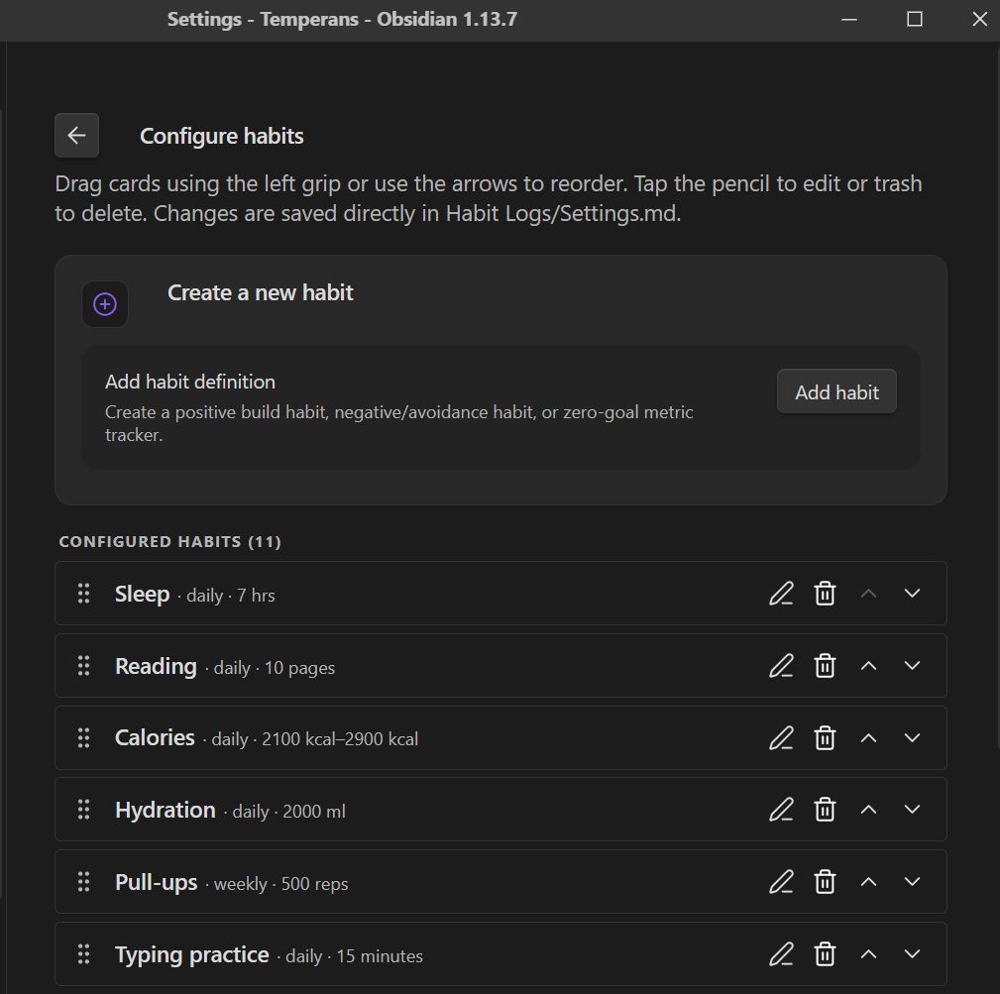 | 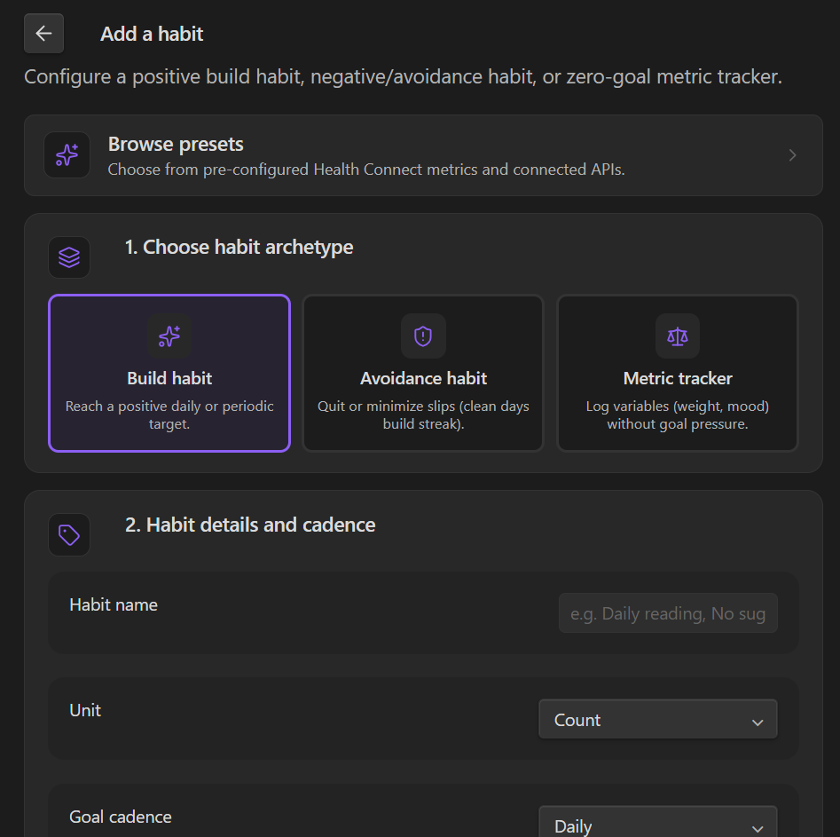 |

### Preset templates

Jump-start tracking with pre-configured templates accessible from the **Browse presets** action at the top of the habit creation form:

| Health Connect presets | Connected APIs presets |
| :---: | :---: |
| 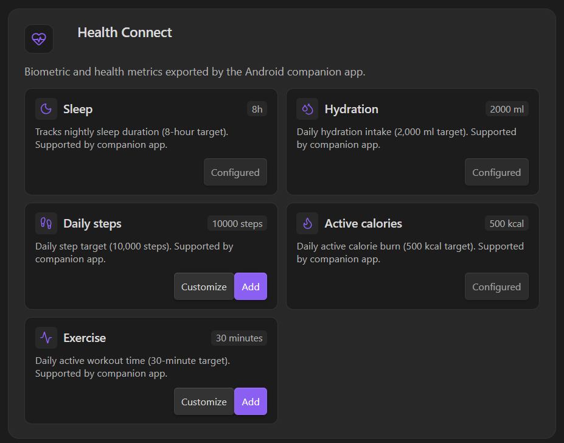 | 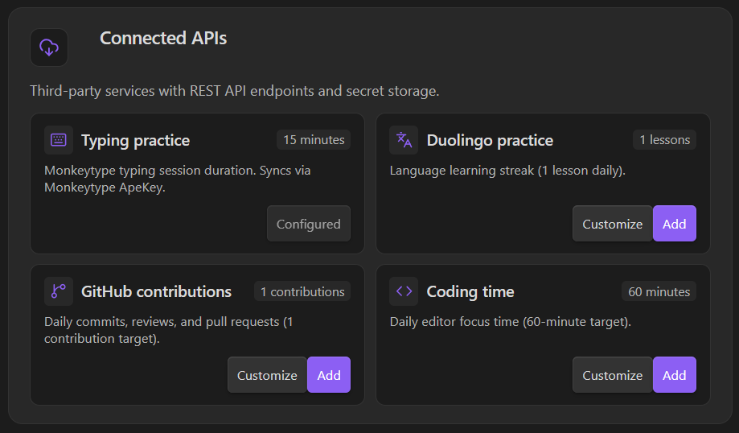 |

- **Health Connect**: Sleep duration, hydration volume, daily steps, active calories, and exercise minutes.
- **Connected APIs**: Monkeytype typing duration, Duolingo practice, GitHub contributions, and WakaTime coding time.

To change targets or add a historic target revision manually, edit `Habit Logs/Settings.md`. For example:

```yaml
# 1. Build habit
- id: reading
  name: Daily Reading
  unit: pages
  cadence: daily
  enabled: true
  type: session
  targetHistory:
    - effectiveDate: 2026-08-21
      min: 15

# 2. Avoidance habit
- id: no-junk
  name: No Junk Food
  unit: incidents
  cadence: daily
  enabled: true
  type: avoidance
  targetHistory:
    - effectiveDate: 2026-08-21
      max: 0

# 3. Zero-goal metric tracker
- id: weight
  name: Body Weight
  unit: kg
  cadence: daily
  enabled: true
  type: tracker
  targetHistory:
    - effectiveDate: 2026-08-21
```

The dashboard automatically refreshes after a saved entry and when you edit a note directly.
- **Continuous Progress Gradient**: For any selected habit, partially completed days accurately reflect the exact percentage achieved against your goal (e.g. `12 / 15 km (80% complete)`) across 4 intensity shades instead of defaulting to a static 50%.
- **Responsive Calendar**: Full Jan–Dec 53-week view on desktop panes; interactive 7x5 monthly grid on mobile viewports.
- **Theme Harmony**: Respects your active Obsidian theme styling, fonts, and button aesthetics. Customize the heat-map accent color in **Settings → Temperans Habits → Heat-map color**.

## Customize habit logging in Settings.md

Add an optional `logging` block **inside a habit** in the YAML frontmatter of `Habit Logs/Settings.md`. Omitted options retain their defaults; no extra controls appear in habit creation. Save the note and reopen the logger to see changes.

For example, an existing minutes habit can include:

```yaml
  logging:
    amount:
      label: Practice time
      placeholder: "30 or 0:30"
      description: "How long did you practice?"
    remark:
      label: Reflection
      placeholder: "What improved today?"
    quickEntry:
      values: [10, 25, "0:30"]
      mode: add
      showClear: false
```

- `amount`, `remark`, and `title` accept `label`, `placeholder`, and `description`. `title` applies to session habits; `amount` changes their primary progress field. Empty strings hide default placeholder or description text.
- `quickEntry: false` hides the entire quick-entry row for that habit. A configuration object accepts `values`, `mode: add` (increment) or `mode: set` (replace), and `showClear`. `values: []` removes value buttons; set `showClear: false` to remove Clear too.
- Numeric quick entries use the habit's unit. Time strings follow the duration rules below. Existing sleep/duration habits use minutes for numeric quick entries; typing uses seconds. Explicit strings such as `"7h 30m"` or `"15m"` avoid ambiguity.
- For session habits, quick entries update the pending session's primary amount. For other habits they save immediately. Clear resets the current amount to zero, or empties the pending session field.

Time habits with units `minutes`, `hours`, or `seconds` accept ordinary numbers in that unit, `H:MM`, and explicit durations such as `1h 30m`, `90m`, or `45s`. For a minutes habit, `90`, `1:30`, and `1h 30m` all record 90 minutes. For an hours habit, `1.5` records 1.5 hours. No format toggle is needed.

Existing sleep/duration habits retain bare-hour and `H:MM` entry; typing retains bare-minute and `M:SS` entry. Both also accept explicit duration strings. Existing log values and targets keep their units.

| Daily habit logging | Goal achieved celebration |
| :---: | :---: |
| 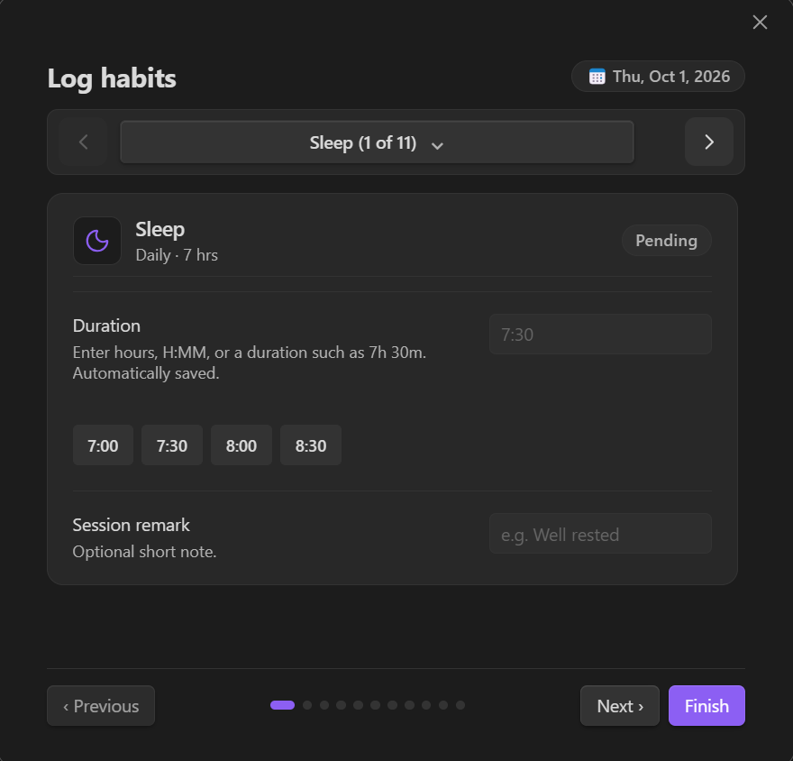 | 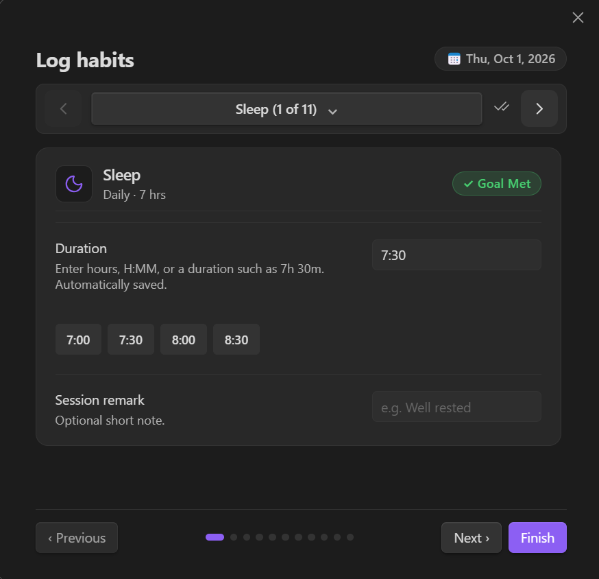 |

## Declarative dashboard configuration (`Habit Logs/Dashboard.md`)

Temperans Habits features a modular, widget-based dashboard engine. The layout, ordering, and fine-grained options of components are controlled declaratively by a dedicated Markdown note: `Habit Logs/Dashboard.md`.

You can reorder, duplicate, or omit widgets to design your own custom dashboard layout. Open `Dashboard.md` from **Settings → Temperans Habits → Customize dashboard layout** (or via the Command Palette: **Temperans Habits: Customize dashboard layout**).

### Example `Habit Logs/Dashboard.md` with full widget options

```yaml
---
temperans: dashboard
version: 1
layout:
  # 1. Header with custom title/subtitle, quick-log action, and habit dropdown
  - widget: header
    title: "My Habit Dashboard"              # Optional custom heading
    subtitle: "Daily consistency tracker"    # Optional custom description
    showActions: true                        # Show or hide Log today and action buttons
    showPeriodNav: true                      # Show or hide period navigation (‹ 2026 ›)
    showFilter: true                         # Show or hide the habit filter dropdown

  # 2. Analytics cards (pick which cards appear and in what order!)
  - widget: stats
    cards:
      - consistency         # Daily or habit consistency rate
      - total-volume        # Total volume (reps, pages, km, hours, etc.)
      - active-average      # Average on active days or per session
      - peak-day            # Single-day peak amount & date
      - current-streak      # Active consecutive streak
      - best-streak         # Longest streak this year

  # 3. Calendar & Heat Map View
  - widget: calendar        # (or widget: heatmap)
    showLegend: true        # Show or hide Less...More intensity legend
    mode: auto              # auto (responsive), year (always 53-week), or month (monthly grid)

  # 4. Periodic goals & targets (weekly, monthly, quarterly, annual)
  - widget: period-goals
    cadences: [weekly, monthly, quarterly, annual] # Specify cadences or omit to show all

  # 5. Selected day inspector & multi-entry session logs
  - widget: day-detail
    showSessions: true      # Show or hide multi-entry session logs
    showNotes: true         # Show or hide task notes

---
```

If you prefer to move `day-detail` above `calendar`, remove `period-goals`, show only a specific subset of stats cards, or force a Monthly Calendar view on desktop, simply edit `Dashboard.md`. The dashboard automatically detects changes and live-refreshes your layout. Header arrows follow the first calendar widget's mode, stepping by month (including across years) or year as configured.

Custom JavaScript widgets are not part of this release. Old `script` entries in Dashboard.md are ignored; remove them from the layout. Declarative built-in widget customization remains supported.

## Embedded Markdown Codeblocks (```temperans-dashboard)

Because all widgets are modular components, you can embed live, interactive habit summaries directly into your journal, homepage, or project notes:

````markdown
```temperans-dashboard
habit: reading
year: 2026
widgets:
  - stats
  - calendar
  - day-detail
```
````

Or embed just a specific habit's streak and heat map:

````markdown
```temperans-dashboard
habit: reading
widgets:
  - stats
  - day-detail
```
````

Embedded codeblocks are reactive and automatically update when you log or edit habits.

## Habit analytics & performance insights

Temperans Habits provides a generic analytics engine that automatically computes deep metrics for **any** task:

* **Interactive In-Dashboard Analytics**:
  Selecting any habit from the dashboard dropdown transforms the statistics cards into that task's dedicated metrics:
  * **Consistency rate**: Percentage of elapsed days or periods meeting target.
  * **Total volume**: Cumulative reps, pages, hours, milliliters, or count across the year.
  * **Average on active days** (or **Average per session** for multi-entry habits like Reading or Workouts).
  * **Single-day peak**: Highest recorded amount with exact date.
  * **Habit current streak & best streak**: Dedicated consecutive streaks for that specific task.
  * For weekly/monthly habits: Period success rate (e.g. `32 / 34 weeks`), average per week, and best period total.
* **Side-by-side Analytics Summary**:
  Run **Temperans Habits: Open habit analytics summary** (or choose **Analytics summary** in Habit actions) to open an all-in-one report comparing all your configured tasks side-by-side with volume, averages, and streaks.

| Quick actions palette | Comprehensive analytics summary |
| :---: | :---: |
| 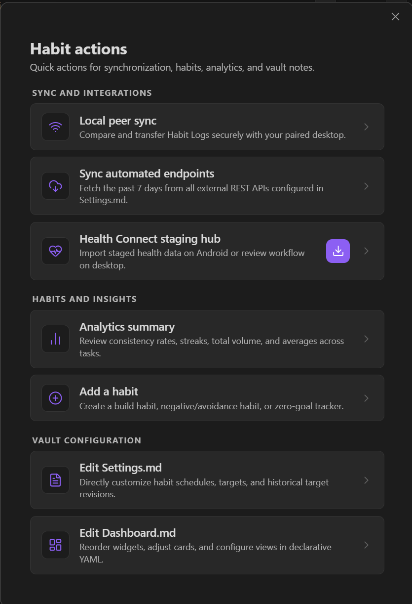 | 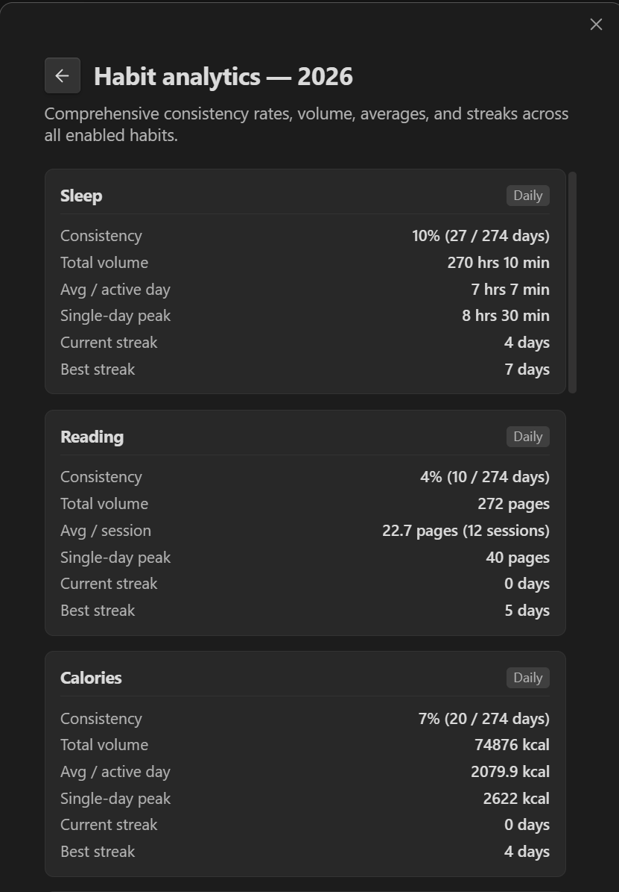 |

## Automated API endpoints (Monkeytype, WakaTime, Duolingo, GitHub, etc.)

Temperans Habits includes a generic, declarative endpoint runner. Any task defined in `Habit Logs/Settings.md` can optionally specify an `endpoint` block to automatically fetch and aggregate data from an external REST API without writing custom plugin code. API keys and tokens stay securely in Obsidian Secret Storage, referenced only by their secret name in Markdown.

### How it works

When syncing, Temperans evaluates your URL template, applies dynamic date variables, sends authenticated requests, extracts daily records from the JSON response, aggregates them (e.g. sum, count, max), and writes them to your daily habit notes under `source: endpoint`. Existing manual entries are always protected.

### Configuration prototype in `Habit Logs/Settings.md`

Add an `endpoint:` block under any task in `Habit Logs/Settings.md`. Here are common examples:

#### 1. Monkeytype (Typing duration in minutes)
```yaml
- id: typing
  name: Typing practice
  unit: minutes
  cadence: daily
  enabled: true
  targetHistory:
    - effectiveDate: 2000-01-01
      min: 15
  endpoint:
    sourceName: "monkeytype"        # Custom label saved under "source:" in daily Markdown logs
    url: "https://api.monkeytype.com/results?onOrAfterTimestamp={{startMillis}}&limit=1000"
    testUrl: "https://api.monkeytype.com/users/currentTestActivity"
    auth:
      type: header
      headerName: Authorization
      secretKey: "temperans-habits-monkeytype-apekey" # Name in Obsidian Secret Storage
      prefix: "ApeKey "
    response:
      recordsPath: "data"           # Array location in response JSON
      dateField: "timestamp"        # Date or epoch timestamp property
      valueField: "testDuration"    # Metric to aggregate
      aggregation: sum              # sum, count, max, or latest
      valueTransform: "divideBy:60"  # Converts seconds to minutes
```

#### 2. WakaTime (Coding time in minutes)
```yaml
- id: coding
  name: Coding
  unit: minutes
  cadence: daily
  enabled: true
  targetHistory:
    - effectiveDate: 2026-01-01
      min: 60
  endpoint:
    sourceName: "wakatime"
    url: "https://wakatime.com/api/v1/users/current/summaries?start={{startDate}}&end={{endDate}}"
    auth:
      type: header
      headerName: Authorization
      secretKey: "wakatime-api-key"
      prefix: "Bearer "
    response:
      recordsPath: "data"
      dateField: "range.date"
      valueField: "grand_total.total_seconds"
      aggregation: sum
      valueTransform: "divideBy:60"
```

#### 3. GitHub (Daily commit/event count)
```yaml
- id: commits
  name: GitHub activity
  unit: count
  cadence: daily
  enabled: true
  targetHistory:
    - effectiveDate: 2026-01-01
      min: 3
  endpoint:
    sourceName: "github"
    url: "https://api.github.com/users/YOUR_USERNAME/events"
    auth:
      type: header
      headerName: Authorization
      secretKey: "github-pat"
      prefix: "Bearer "
    response:
      recordsPath: ""               # Root array
      dateField: "created_at"       # ISO 8601 timestamp string
      aggregation: count            # Counts number of events on each day
```

### Supported configuration options

* **Source Label & Icon (`sourceName`)**:
  * Optional label saved under `source:` in daily habit logs and rendered as an icon badge in your dashboard:
    * **Automatic Built-in Icons**: Recognized names automatically render crisp, theme-matching SVG icons with zero system bloat:
      * `"monkeytype"` $\to$ Keyboard icon
      * `"health-connect"` $\to$ Heart-pulse icon
      * `"github"` $\to$ GitHub icon
      * `"wakatime"` $\to$ Code icon
      * `"strava"` $\to$ Footprints/Activity icon
      * `"duolingo"` $\to$ Languages icon
      * `"endpoint"` $\to$ Cloud-download icon
    * **Lucide Icon Names**: Prefix any Obsidian Lucide icon with `lucide:` or `icon:` (e.g. `sourceName: "lucide:flame"`, `sourceName: "lucide:dumbbell"`).
    * **Custom Images**: Specify a local image file path, URL, or data URI (e.g. `sourceName: "assets/icons/app.png"` or `sourceName: "https://.../icon.svg"`).
    * **Inline SVG**: Provide raw SVG markup directly (e.g. `sourceName: "<svg ...>...</svg>"`).
    * **Text Badge**: Any unrecognized plain text renders as a clean pill badge.
    * Hovering over any icon in the Day Detail panel shows an Obsidian tooltip with the full source name.
* **URL Template Variables**:
  * `{{today}}`, `{{startDate}}`, `{{endDate}}`: formatted as `YYYY-MM-DD`.
  * `{{startMillis}}`, `{{endMillis}}`: epoch millisecond timestamps.
  * `{{startSeconds}}`, `{{endSeconds}}`: epoch second timestamps.
* **Authentication (`auth`)**:
  * `type: header`: Sends an HTTP header (default `Authorization`). Specify `prefix` such as `Bearer ` or `ApeKey `.
  * `type: query`: Appends a query parameter to the URL (e.g. `?api_key=...`).
  * `type: none`: For open endpoints.
  * `secretKey`: The identifier used to retrieve the token from Obsidian Secret Storage.
* **Response Mapping (`response`)**:
  * `recordsPath`: Dot-separated path to the JSON records array (e.g. `data`, `items`, or empty `""` if the root payload is an array). Also supports dictionary objects keyed by date.
  * `dateField`: Property holding the date (`YYYY-MM-DD`, ISO 8601 string, or epoch timestamp).
  * `valueField`: Property holding the numeric value.
  * `aggregation`: `sum` (total for the day), `count` (number of records for the day), `max` (highest recorded value), or `latest` (most recent value).
  * `valueTransform`: Optional math scaling: `divideBy:60` (e.g. seconds to minutes), `multiplyBy:60` (e.g. hours to minutes), or `none`.

### Testing and syncing

* **Settings → Temperans Habits → Automated API endpoints**:
  Every task with an `endpoint` configured in `Settings.md` appears in this section with a **Test connection** button, a **Sync past 7 days** button, and an Obsidian Secret Storage component to set or update its secret key.
* **Command Palette**:
  Each endpoint task dynamically receives a command: `Temperans Habits: Sync <Task Name> from endpoint`, alongside `Temperans Habits: Sync all external endpoints`.
* **Logging Modal**:
  Opening the log modal for any endpoint-enabled task shows an on-demand sync button alongside manual logging.

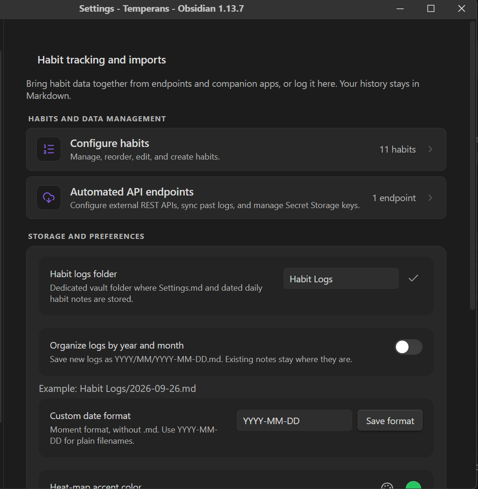

## Third-party integrations

Health Connect uses the separate [Android companion](android-companion/README.md), because an Obsidian mobile plugin cannot add Android Health Connect permissions to Obsidian’s signed app manifest. The companion requests read access only to nutrition energy, hydration, sleep sessions, steps, distance, active calories, total calories, exercise, floors, heart rate, resting heart rate, and weight; it has no history permission, background read, Health Connect write access, account, analytics, or backend.

On Android, choose the vault’s `Habit Logs` folder itself in the companion (not the vault root), grant the read permissions to health metrics you want to track, and press **Export available data**. The companion uses Health Connect’s daily aggregation API to read Nutrition **Energy** (kcal) and hydration volume across every source; all other nutrition fields are discarded. A bounded sleep-session read retains wake-up-day assignment. It writes one local staging file, `Habit Logs/.temperance-staging.json`, without touching Markdown. Then open **Temperans Habits → Third-party sync → Import staged data** on any device with the staging file in its vault. The importer is open-ended: it validates provenance IDs and time zone, then imports any metric matching an enabled task in `Settings.md` (including `calories`, `hydration`, `sleep`, `steps`, or future metrics like `pullups`):

- creates missing metric values with `source: health-connect`;
- refreshes values already owned by `health-connect` on repeated exports;
- safely skips metrics that have not been added as tasks in `Settings.md`;
- protects manual values and sessions, including legacy entries, and values owned by a different integration.

**Health Connect sync → Staging file path** is collapsed by default; click its heading to edit. It lets you choose a JSON filename or subfolder **inside the configured operation folder**, for example `Habit Logs/Exports/health.json`. Enter the complete vault-relative path. Absolute paths, traversal, hidden directories, reserved filenames, and paths outside that folder are rejected. Click **Save path**, or import to save and use the edited path. Clear the field to restore `<Habit Logs folder>/.temperance-staging.json`. The setting is stored in local plugin configuration. It does not move files or change the Android companion's export destination; the selected path must match the exported file.

The staging file is **retained after import**, including failed, protected, and skipped records. You can configure missing habits and retry; the companion replaces the export on its next run. Temperans never deletes a newer export during cleanup. The importer accepts at most 2 MiB of JSON and serializes concurrent imports of the same path. Run **Local peer sync** afterwards to transfer the selected dated Markdown logs to desktop. The staging JSON itself is intentionally never peer-synced.

The companion’s `minSdk` is Android 9, the minimum supported version for Health Connect.

## Local peer sync

Open **Temperans Habits: Open local peer sync** on the desktop and start the temporary host. The desktop immediately displays a pairing QR code alongside the local network address and pairing code.

On your mobile device:
- **Native Camera Deep Link**: Point your standard camera or Google Lens at the desktop QR code. Tapping the detected `obsidian://temperans-pair` link opens Obsidian and configures the paired desktop profile instantly.
- **Clipboard Fallback**: Tap **Paste pairing from clipboard** inside the mobile Peer Sync modal to configure URL and pairing code in 1 tap.

Peer sync requires mutual challenge-response authentication and AES-256-GCM encrypted RPC, with session keys derived through PBKDF2 (100,000 iterations) and a fresh session salt. Pairing-key changes and host shutdown revoke sessions; replayed encrypted requests are rejected. Handshakes, request sizes, connection count, and session lifetime are bounded. Update both devices before pairing.

The temporary host listens on local IPv4 interfaces while enabled. Use a trusted network and stop hosting when finished. This implementation has automated protocol coverage but has not undergone an independent cryptographic assessment.

The host is desktop-only, while Android is an outbound client. Files that differ require an explicit direction; a hash is checked again immediately before overwrite. The plugin does not configure WireGuard, discover devices through mDNS, sync automatically, or transfer any files outside `Habit Logs`.


## Data ownership

All targets and daily logs live as Markdown/YAML in your vault. New logs default to plain `Habit Logs/YYYY-MM-DD.md` filenames.

In **Settings → Temperans Habits → Storage & Preferences**:

- **Organize logs by year and month** enables `YYYY/MM/YYYY-MM-DD.md`. It is off by default.
- **Custom date format** accepts [Moment formatting tokens](https://momentjs.com/docs/#/displaying/format/), such as `DD-MM-YYYY`, `YYYY/MMMM/DD-dddd`, or `[Practice]/YYYY-MM-DD`. Enter the format without `.md`; the example path updates while you type. Click **Save format** or press Enter to apply it.

With year/month organization off, the saved custom format applies, or `YYYY-MM-DD` by default. Formats must identify a complete date and produce valid paths inside the operation folder.

Changing the naming mode never moves or renames existing notes. Temperans updates an existing day's note in place and discovers old custom names using their stored ISO date, so flat, nested, and custom histories can coexist. Notes retain their body text and unrelated frontmatter. Peer sync identifies daily files by date and uses the receiving device's chosen layout for new files, keeping existing destination paths intact. Settings.md and Dashboard.md keep their existing locations.

New and edited daily logs use one consistent top-level map per task: `typing`, `reading`, and custom habits. Numeric tasks use `value`, `source`, and an optional `note`; typing adds `value_unit`, `tests`, and imported results, while multi-entry habits use `sessions` with optional notes. This keeps every integration’s write path predictable without a separate metadata block.

```yaml
temperans: habit-log
temperans_schema: 3
date: 2026-08-22
calories: { value: 2200, source: health-connect }
guitar: { value: 15, source: manual }
typing:
  value: 930
  value_unit: seconds
  tests: 21
  source: monkeytype
  imported: []
reading:
  sessions: []
```

Obsidian plugin storage retains local display/configuration state; the optional Monkeytype ApeKey and peer-sync pairing secrets use Obsidian Secret Storage. Health Connect staging data remains only in the selected local vault folder until replaced by the companion or removed by you.

The plugin and companion have no hosted backend or telemetry. Optional endpoint integrations contact the services you configure. Local peer sync transfers selected habit files, which can contain health data, to the paired device.

Stat cards automatically scale large values for readability: 100,000 ml becomes 100 L, 300 minutes becomes 5 h, and 1,000 hours becomes 41.7 days. Other large counts use k, mn, and bn suffixes. Card values are rounded to one decimal place; stored values, logging inputs, and goals keep their original precision and units. Save feedback appears as a quiet icon beside the selected habit name, with status text available to assistive technology and on hover.

## History-loading performance

History discovery uses Obsidian metadata when available, then reads only the requested logs. File edits and renames update individual index entries. Parsed-log caching is bounded to 800 entries and an estimated 16 MiB serialized payload; up to four content reads run at once, shared across consumers. Large discovery and loading jobs yield to the host, and plugin unload cancels further reads.

If metadata is unavailable, discovery still reads the history in cooperative batches. Before creating a missing day, unverified metadata hints are checked against file contents so custom-named notes cannot be duplicated. These fallback checks prioritize data integrity. Dashboards show controls and daily details before broader history. Widgets request only their required dates; annual statistics retain their full yearly scope even with a month calendar. Hidden views and offscreen embeds defer history work, obsolete requests are cancelled, and matching selected-habit analytics are shared between views.

## Roadmap

**Shared challenges (exploratory, after the first release):** allow friends to contribute toward a shared target, such as one million pull-ups. Contributions would carry a separate contributor identity alongside their data source, with combined totals, individual breakdowns, contributor colors and labels, and filters for everyone, yourself, or selected friends. Sharing would be explicit per habit, with personal tracking remaining available independently.

This is a candidate for a future pilot, subject to user demand and feasibility, not a committed release feature. It would require duplicate-safe contribution records, correction/conflict handling, clear authorship and privacy rules, and aggregation appropriate to each habit. The loading architecture should support date- and contributor-scoped queries so shared histories do not add full-folder work at startup.

## Development and release verification

Use Node 22.13+ and the pinned pnpm version. Run `pnpm install --frozen-lockfile`, `pnpm typecheck`, `pnpm lint`, `pnpm test`, `pnpm build`, and `pnpm check:release`. The lint gate checks official Obsidian-specific rules; TypeScript checks run separately. Browser fixtures use pinned Playwright: install Chromium with `pnpm exec playwright install chromium`, set `BROWSER_CHANNEL=chromium`, then run `pnpm test:responsive`. Windows can use the installed Edge browser with the default channel.
